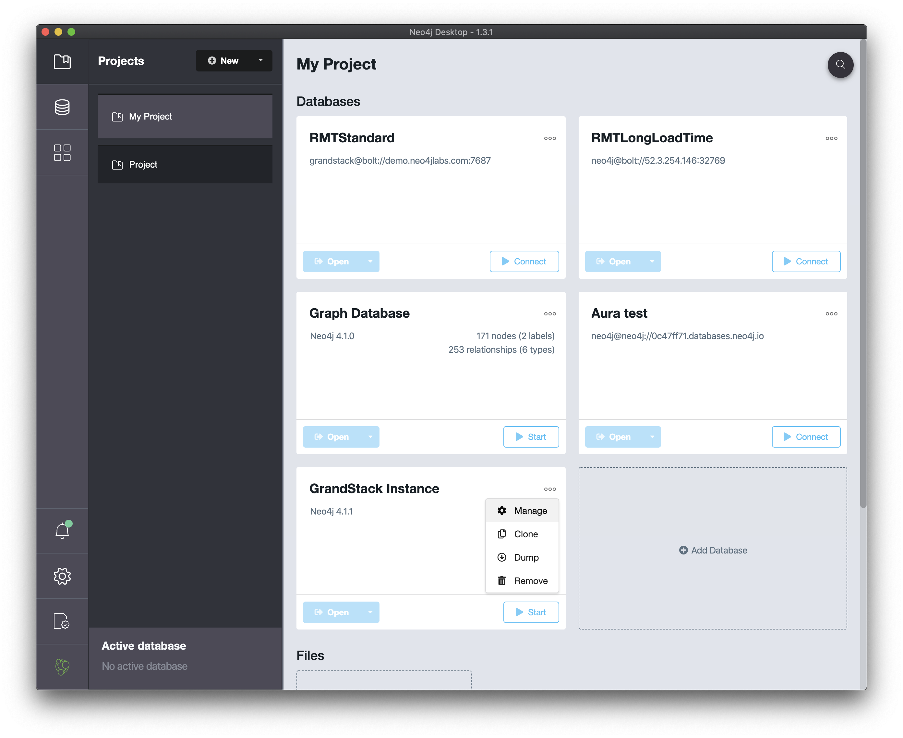
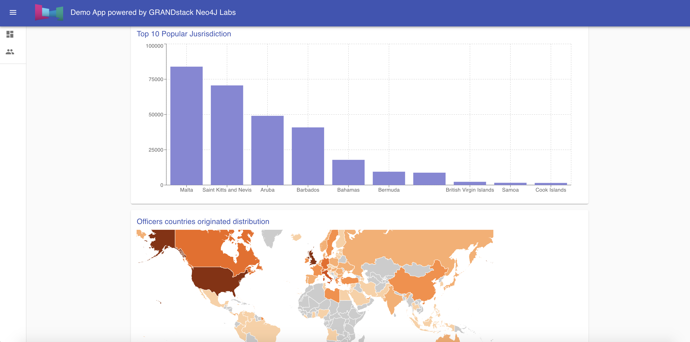
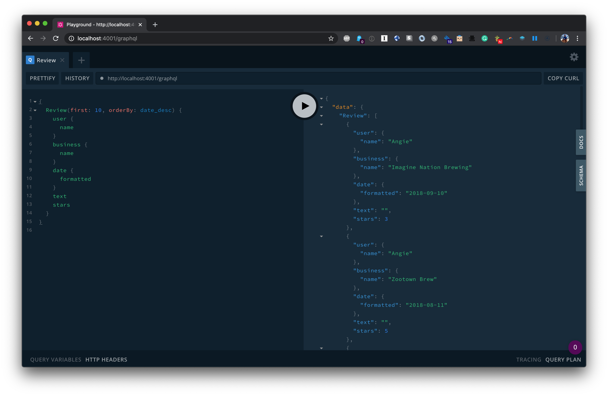

[](https://grandstack.io/deploy-starter-netlify) [](https://grandstack.io/deploy-starter-vercel) [](https://sandbox.neo4j.com/?usecase=blank-sandbox)

# GRANDstack Starter

This project is created from starter project template for building a [GRANDstack](https://grandstack.io) (GraphQL, React, Apollo, Neo4j Database) application. There are two components to the starter, the web frontend application (in React and Angular flavors) and the API app (GraphQL server).

## Quickstart

The easiest way to get started with the GRANDstack Starter is to create a Neo4j Sandbox instance and use the `create-grandstack-app` command line tool.

(If you have a running Neo4j database on localhost via Neo4j Desktop or a Neo4j server installation, change the password in `api/.env`)

### 1. Create A Neo4j Instance

#### Option :one: - Sandbox

[Neo4j Sandbox](https://neo4j.com/sandbox) allows you to create a free hosted Neo4j instance private to you that can be used for development.

After singing in to Neo4j Sandbox, click the `+ New Project` button and select the "Blank Sandbox" option. In the next step we'll use the connection credentials from the "Connection details" tab to connect our GraphQL API to this Neo4j instance.


#### Option :two: - Desktop

If you instead would like to use [Neo4j Desktop](https://neo4j.com/download/). The process will be almost the same with a minor detour. Install Neo4j Desktop for your chosen OS and then make a new blank graph for your project. It will require you to put in a password and username. Remember those.

Next you need to go to open the manage screen from the options in the 3 dot stack menu



And install the apoc plugin, green button at the top of the list.


After that you can return to setting up your app with the credentials from the prior steps.

### 2. Run the `npm install` script at both api and web-react-ts folders to install all required dependencies

```
cd api
npm i
```

```
cd web-react-ts
npm i
```

### 3. Seed the database by importing the paradise paper database using neo4j-admin tool

Make sure your application is running locally with `npm start` or `yarn start`, open another terminal and run

```
npm run seedDb
```

or with Yarn

```
yarn run seedDb
```

### 4. Run npm start at root folder to start both api and front-end dev server

```
npm start
```

### 5. The homepage will be automatically opened in a Browser. Otherwise it can be opened at http://localhost:3000



## <a name="overview"></a> Overview

The GRANDstack Starter is a monorepo that includes a GraphQL API application and client web applications for React (default) and Angular for a business reviews dashboard.

### `/` - Project Root

The root directory contains some global configuration and scripts:

- `npm run start` and `npm run build`
- ESLint (.eslintrc.json) for code linting
- Prettier (.prettierrc.json) for code formatting
- Git hooks for applying formatting on commit

### [`/api`](./api)



This directory contains the GraphQL API application using Apollo Server and neo4j-graphql.js.

- Change environment variable settings in `.env`:

```
# Use this file to set environment variables with credentials and configuration options
# This file is provided as an example and should be replaced with your own values
# You probably don't want to check this into version control!

NEO4J_URI=bolt://localhost:7687
NEO4J_USER=neo4j
NEO4J_PASSWORD=letmein

# Uncomment this line to enable encrypted driver connection for Neo4j
#NEO4J_ENCRYPTED=true

# Uncomment this line to specify a specific Neo4j database (v4.x+ only)
#NEO4J_DATABASE=neo4j

GRAPHQL_SERVER_HOST=0.0.0.0
GRAPHQL_SERVER_PORT=4001
GRAPHQL_SERVER_PATH=/graphql

```

### [`/web-react`](./web-react)


The frontend React web application is found in this directory.

It includes:

- Material UI
- React router
- Apollo Client / React Hooks
- Create React App

### [`/web-react-ts`](./web-react-ts)

A UI built with [CRA](https://reactjs.org/docs/create-a-new-react-app.html)

_Start the React dev server_

```
cd ./web-react-ts && npm start
```

## Deployment

### Netlify

This monorepo can be deployed to Netlify. The frontend application will be served over Netlify's CDN and the GraphQL API will be provisioned as a serverless GraphQL API lambda function deployed to AWS (via Netlify). A netlify.toml file is included with the necessary build configurations. The following environment variables must be set in Netlify (either via the Netlify web UI or via the command line tool)

```
NEO4J_URI
NEO4J_USER
NEO4J_PASSWORD
```

See the "Hands On With The GRANDStack Starter" video linked at the beginning of this README for a walkthrough of deploying to Netlify.

### Vercel

Vercel can be used with monorepos such as grand-stack-starter. [`vercel.json`](https://github.com/grand-stack/grand-stack-starter/blob/master/vercel.json) defines the configuration for deploying with Vercel.

1. get [vercel cli](https://vercel.com/download)
2. Set the vercel secrets for your Neo4j instance:

```
vercel secret add grand_stack_starter_neo4j_uri bolt://<YOUR_NEO4J_INSTANCE_HERE>
vercel secret add grand_stack_starter_neo4j_user <YOUR_DATABASE_USERNAME_HERE>
vercel secret add grand_stack_starter_neo4j_password <YOUR_DATABASE_USER_PASSWORD_HERE>
```

3. Run `vercel`

## Docker Compose

You can quickly start via:

```
docker-compose up -d
```

If you want to load the example DB after the services have been started:

```
docker-compose run api npm run seedDb
```

See [the project releases](https://github.com/grand-stack/grand-stack-starter/releases) for the changelog.

You can find instructions for other ways to use Neo4j (Neo4j Desktop, Neo4j Aura, and other cloud services) in the [Neo4j directory README.](./neo4j)

This project is licensed under the Apache License v2.
Copyright (c) 2020 Neo4j, Inc.
